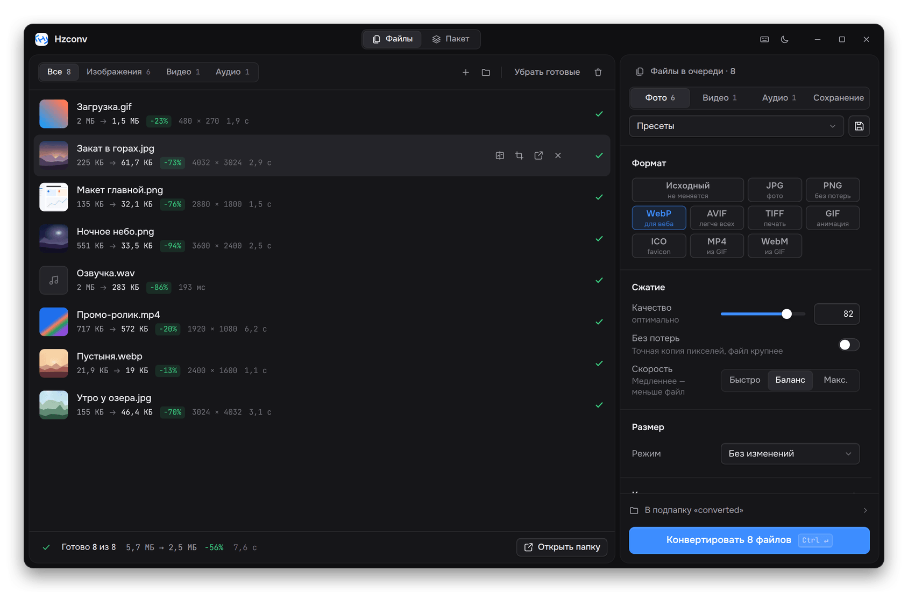
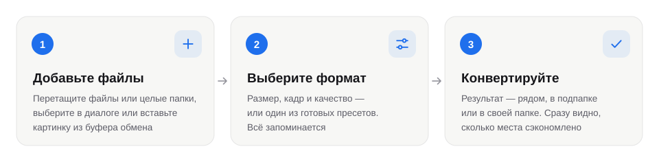
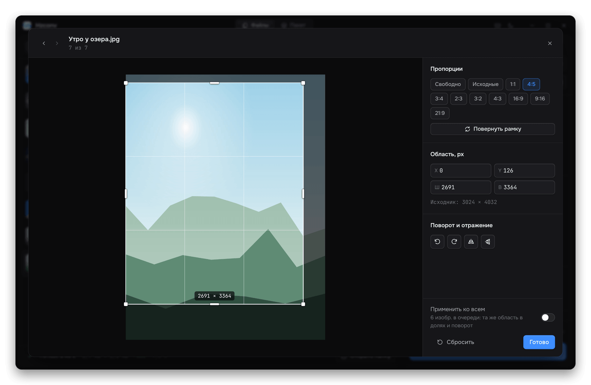
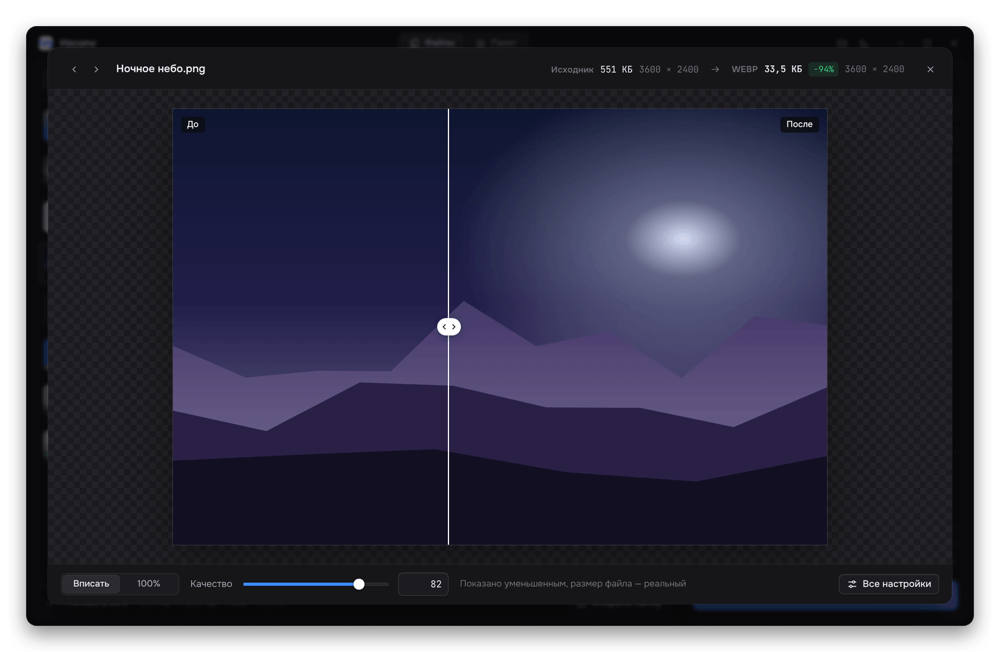
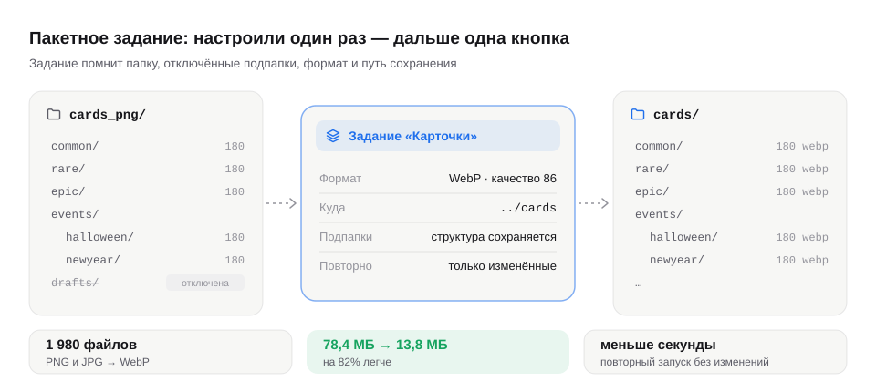
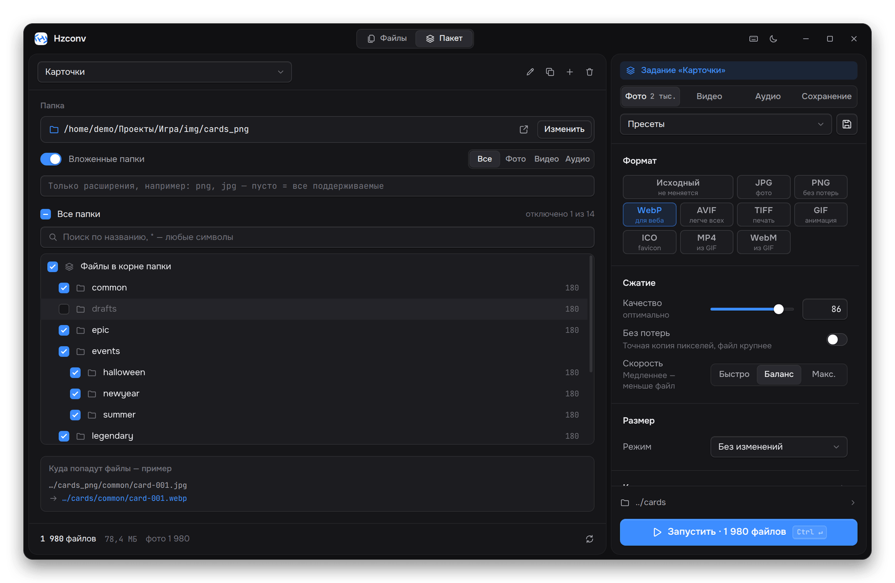
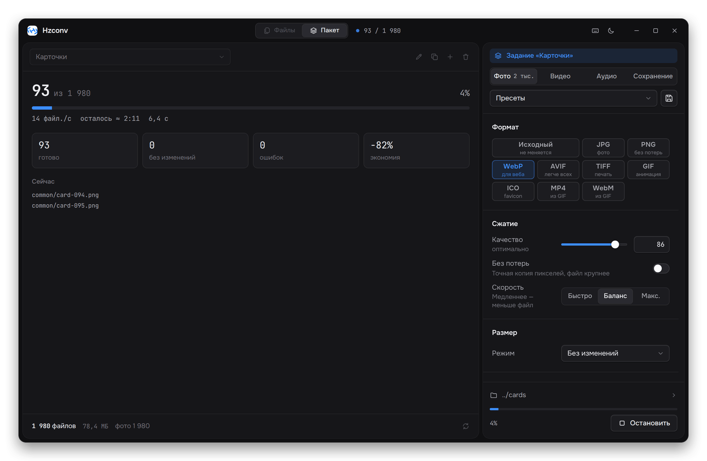
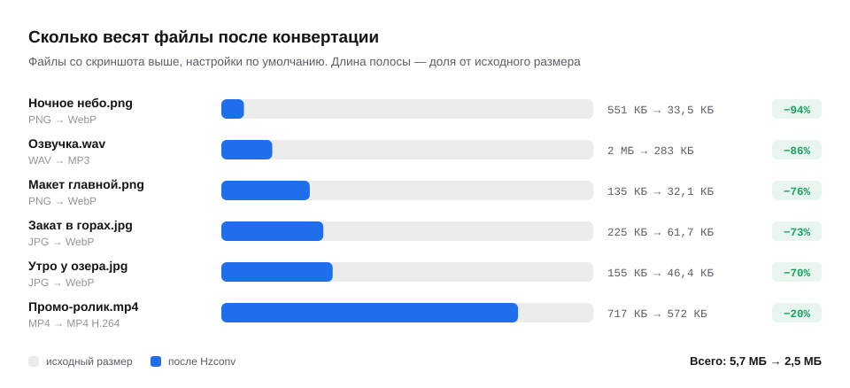
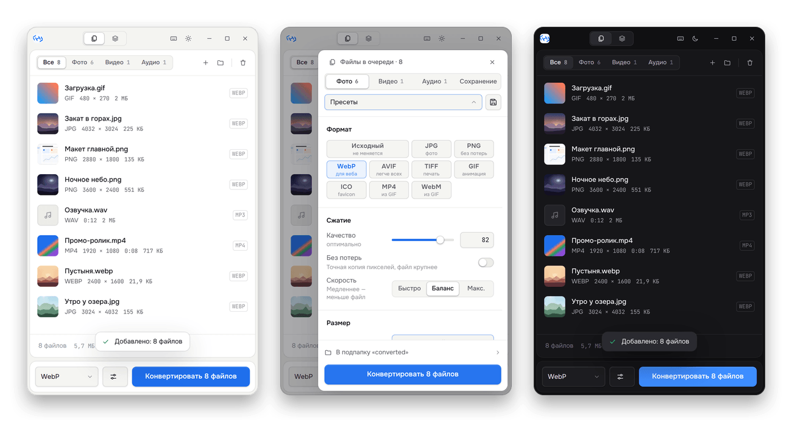
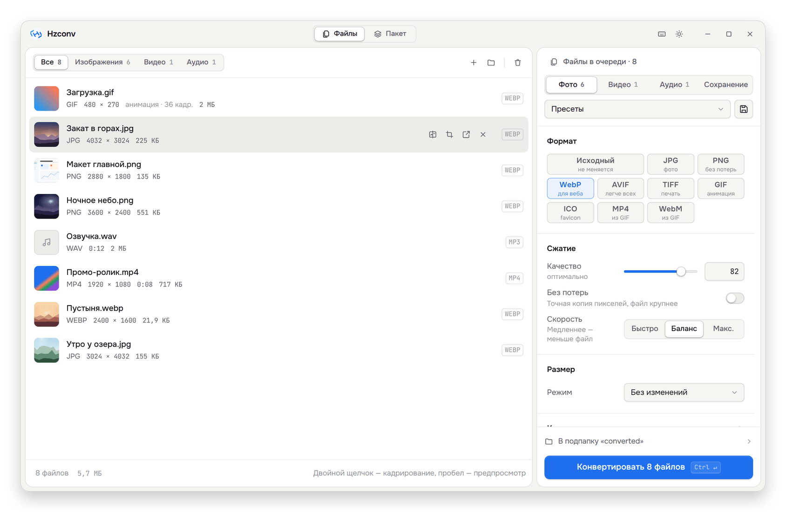

<p align="center">
  
</p>

<h1 align="center">Hzconv</h1>

<p align="center">
  Конвертер изображений, видео и аудио для дизайнеров и разработчиков.<br>
  Уменьшить, обрезать, пережать и разложить по папкам — локально, без облака и без подписок.
</p>

<p align="center">
  <a href="https://github.com/hezeka/hzconv/releases/latest"><b>Скачать</b></a> ·
  <a href="#возможности">Возможности</a> ·
  <a href="#пакетный-режим">Пакетный режим</a> ·
  <a href="#установка">Установка</a> ·
  <a href="#вопросы-и-ответы">Вопросы</a>
</p>

<p align="center">
  
  
  
</p>

<p align="center">
  
</p>

## Коротко

- **Для одного файла и для тысяч.** Перетащили картинку, выбрали формат, нажали «Конвертировать». Или настроили задание для папки с десятками тысяч файлов и запускаете его одной кнопкой.
- **Видно результат до сохранения.** Сравнение «до/после» со шторкой и реальным размером будущего файла.
- **Ничего не теряется.** Исходники не трогаются, пока вы сами не решите их заменить. Метаданные можно сохранить или удалить. Фото с телефона не ложатся на бок.
- **Всё на вашем компьютере.** Файлы никуда не отправляются, интернет не нужен.

<picture>
  <source media="(prefers-color-scheme: dark)" srcset="docs/images/steps-dark.svg">
  
</picture>

## Возможности

### Изображения

- **Форматы:** JPG, PNG, WebP, AVIF, TIFF, GIF, ICO; SVG на входе растеризуется сразу в нужном размере, без мыла.
- **Размер:** в процентах, по ширине, по высоте, по длинной стороне или в рамку «Ш × В» — вписать, заполнить с обрезкой, добавить поля или растянуть.
- **Кадрирование:** редактор с пропорциями 1:1, 4:5, 16:9 и любыми своими, точные координаты в пикселях, поворот и отражение. Для пакетов — «умный» кроп, который сам находит главный объект.
- **Несколько размеров за раз:** @1x @2x @3x для интерфейсов, набор ширин для `srcset`, плотности Android.
- **Сжатие:** качество от 1 до 100, режим без потерь для WebP и AVIF, палитра для PNG (как TinyPNG — файл в 2–4 раза легче).
- **Мелочи, которые экономят время:** обрезка однотонных полей, цвет фона для прозрачности в JPG, «чёткие пиксели» для пиксель-арта и скриншотов, анимация GIF и WebP сохраняется, GIF превращается в лёгкое MP4 или WebM.

### Видео

- MP4, WebM, MOV, MKV, AVI и GIF; кодеки H.264, H.265 и VP9.
- Качество задаётся понятными уровнями — «Максимум», «Высокое», «Баланс», «Компакт» — а не битрейтом наугад.
- Разрешение (4K, 1080p, 720p… без растягивания маленьких роликов), частота кадров, пропорции кадра, обрезка по времени.
- Смена контейнера без перекодирования — мгновенно и без потерь.
- Извлечение звука в MP3, M4A или WAV. GIF с подобранной под ролик палитрой.

### Аудио

- MP3, M4A (AAC), OGG, Opus, FLAC, WAV.
- Битрейт, частота, моно или стерео, выравнивание громкости до −16 LUFS, как на стриминговых площадках.
- Обрезка по времени; при конвертации в MP3 обложка альбома сохраняется.

### Сохранение

- Рядом с исходником, в подпапке или в своей папке — в том числе относительной, например `../export`.
- Структура вложенных папок повторяется в результате.
- Шаблон имени: `{name}`, `{w}`, `{h}`, `{date}`, `{n}`, `{fmt}` — например, `{name}-{w}x{h}` даст `photo-1920x1080.webp`.
- Если файл уже есть: обновить, только если исходник изменился; сохранить рядом с номером; заменить или пропустить.
- По желанию дата изменения переносится с исходника — удобно для фотоархива.

## Штучная работа

Очередь с миниатюрами, размером и длительностью каждого файла. Двойной щелчок открывает редактор кадра, пробел — сравнение «до/после».

<p align="center">
  
  
</p>

В окне сравнения можно двигать ползунок качества и сразу видеть, сколько будет весить файл и появятся ли артефакты — до того как что-то сохранится на диск.

## Пакетный режим

Для регулярных задач: выгрузить на сайт новую партию фото, пересобрать иконки, сконвертировать папку с тысячами игровых карточек. Задание запоминает всё — папку, отключённые подпапки, формат и путь сохранения. В следующий раз достаточно открыть программу и нажать «Запустить».

<picture>
  <source media="(prefers-color-scheme: dark)" srcset="docs/images/batch-flow-dark.svg">
  
</picture>

<p align="center">
  
</p>

**Как настроить задание**

1. Переключитесь на «Пакет» в шапке окна и выберите папку — или просто перетащите её в окно.
2. Снимите флажки с подпапок, которые не нужны. Новые подпапки, появившиеся позже, будут включены сами.
3. Справа выберите формат и во вкладке «Сохранение» укажите, куда класть результат. Пример пути под деревом папок сразу покажет, куда попадёт файл.
4. Нажмите «Запустить». Повторные запуски обработают только новые и изменённые файлы — остальные будут пропущены за доли секунды.

Во время работы видно, сколько файлов готово, скорость, оставшееся время и сэкономленное место. Ошибки собираются в список, а неудавшиеся файлы можно перезапустить одной кнопкой.

<p align="center">
  
</p>

## Сколько места экономит

<picture>
  <source media="(prefers-color-scheme: dark)" srcset="docs/images/savings-dark.svg">
  
</picture>

## Маленькое окно и темы

Окно сжимается до 420 × 480. В компактном режиме настройки выезжают сбоку, а внизу остаются выбор формата и кнопка «Конвертировать» — для простых задач больше ничего не нужно. Светлая и тёмная темы переключаются вручную или следуют за системой.

<p align="center">
  
</p>

<p align="center">
  
</p>

## Форматы

| | Открывает | Сохраняет |
|---|---|---|
| **Изображения** | JPG, PNG, WebP, AVIF, TIFF, GIF, SVG | JPG, PNG, WebP, AVIF, TIFF, GIF, ICO, MP4 и WebM из GIF |
| **Видео** | MP4, MOV, MKV, WebM, AVI, FLV, WMV, MPG, TS, MTS, 3GP, OGV | MP4, WebM, MOV, MKV, AVI, GIF, MP3, M4A, WAV |
| **Аудио** | MP3, WAV, OGG, Opus, FLAC, M4A, AAC, WMA, AIFF, AMR | MP3, M4A, OGG, Opus, FLAC, WAV |

## Горячие клавиши

| Действие | Клавиши |
|---|---|
| Добавить файлы / папку | <kbd>Ctrl</kbd> <kbd>O</kbd> / <kbd>Ctrl</kbd> <kbd>Shift</kbd> <kbd>O</kbd> |
| Вставить картинку из буфера | <kbd>Ctrl</kbd> <kbd>V</kbd> |
| Конвертировать или запустить задание | <kbd>Ctrl</kbd> <kbd>Enter</kbd> |
| Остановить | <kbd>Esc</kbd> |
| Сравнение «до/после» | <kbd>Пробел</kbd> |
| Кадр, поворот, отражение | <kbd>C</kbd> или двойной щелчок |
| Выбрать файл / убрать из очереди | <kbd>↑</kbd> <kbd>↓</kbd> / <kbd>Delete</kbd> |
| Все сочетания | <kbd>?</kbd> |

На macOS вместо <kbd>Ctrl</kbd> — <kbd>⌘</kbd>.

## Установка

Скачайте установщик для своей системы на странице [Releases](https://github.com/hezeka/hzconv/releases/latest).

- **Windows** — запустите установщик `Hzconv Setup <версия>.exe`. Если Windows SmartScreen предупредит о неизвестном издателе, нажмите «Подробнее» → «Выполнить в любом случае».
- **macOS** — откройте `.dmg` и перетащите Hzconv в «Программы». При первом запуске: правый щелчок по приложению → «Открыть».
- **Linux** — сделайте файл `.AppImage` исполняемым (`chmod +x Hzconv-*.AppImage`) и запустите.

FFmpeg и все библиотеки уже внутри — ничего доустанавливать не нужно.

## Вопросы и ответы

<details>
<summary><b>Файлы куда-нибудь отправляются?</b></summary>
<br>
Нет. Вся обработка идёт на вашем компьютере, интернет программе не нужен.
</details>

<details>
<summary><b>Что происходит с метаданными (EXIF, геолокация, цветовой профиль)?</b></summary>
<br>
По умолчанию они удаляются: так файлы легче и в них не остаётся координат съёмки. Если метаданные нужны, в разделе «Фото → Дополнительно → Метаданные» выберите «Сохранять»: EXIF, цветовой профиль и DPI перенесутся даже при повороте и обрезке. Ориентация с телефона применяется всегда — фото не окажется на боку.
</details>

<details>
<summary><b>Почему SVG или маленькая иконка после конвертации стали больше?</b></summary>
<br>
SVG — это векторное описание в несколько сотен байт, а PNG и WebP хранят каждый пиксель. Для иконок это нормально: вы получаете растровую картинку нужного размера. Чтобы размер не рос, выберите нужные размеры через «Несколько размеров» или оставьте SVG как есть.
</details>

<details>
<summary><b>Можно ли пережать файлы «на месте», заменив исходники?</b></summary>
<br>
Да: во вкладке «Сохранение» выберите «Рядом», а в «Если файл уже есть» — «Всегда заменять», формат оставьте «Исходный». Результат сначала пишется во временный файл и только потом заменяет исходник, поэтому при сбое оригинал не повредится. Отменить замену нельзя — лучше попробовать на копии.
</details>

<details>
<summary><b>Как повторно обработать только новые файлы в папке?</b></summary>
<br>
В «Если файл уже есть» выберите «Обновить, если исходник изменился» — для пакетных заданий это значение по умолчанию. Уже готовые файлы пропускаются, заново конвертируются только новые и те, что вы поменяли.
</details>

<details>
<summary><b>Что-то пошло не так. Где посмотреть подробности?</b></summary>
<br>
Нажмите <kbd>?</kbd> → «Журнал ошибок». Там записаны ошибки с путями к файлам — этот журнал пригодится, если будете писать в <a href="https://github.com/hezeka/hzconv/issues">Issues</a>. Даже если обработчик аварийно завершится на повреждённом файле, окно останется открытым: запустите конвертацию ещё раз — с «Обновить, если исходник изменился» готовые файлы будут пропущены.
</details>

## Для разработчиков

Hzconv написан на Electron и Vue 3. Изображения обрабатывает [sharp](https://sharp.pixelplumbing.com) (libvips), видео и аудио — [FFmpeg](https://ffmpeg.org). Тяжёлая работа идёт в отдельном фоновом процессе, поэтому окно не подвисает, а сбой кодека не закрывает приложение.

```bash
npm ci          # зависимости
npm run dev     # режим разработки с горячей перезагрузкой
npm test        # интеграционные тесты движка на реальных sharp и FFmpeg
npm run build   # установщик для текущей ОС — в папке build/
```

Нужен Node.js 20.9 или новее.

```
main.js                 окно и связь интерфейса с движком
preload.js              безопасный мост между окном и main
src/main/               движок: конвертация, очередь, пакетные задания
  pipeline/             sharp (изображения, ICO) и FFmpeg (видео, аудио, GIF)
  engine/               фоновый процесс обработки
src/renderer/           интерфейс на Vue 3
src/shared/             форматы и настройки по умолчанию — общие для движка и интерфейса
test/                   тесты
```

Нашли ошибку или есть идея — открывайте [Issue](https://github.com/hezeka/hzconv/issues).

## Лицензия

Код Hzconv распространяется под лицензией ISC. В комплект входят сборки FFmpeg из пакета `ffmpeg-static` под лицензией GPL-3.0-or-later и библиотека libvips под LGPL-3.0 — их тексты лежат рядом с бинарниками в установленной программе.
